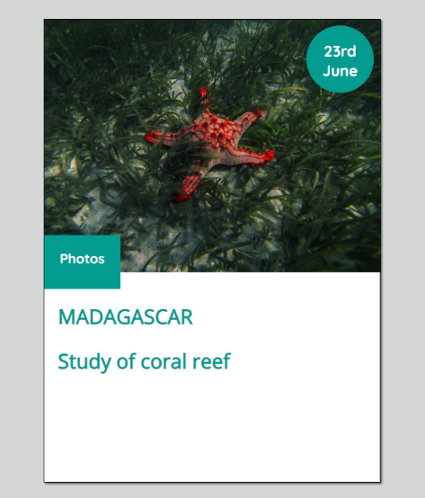

# Learning Sass

Premier exercice d'application de ***Sass***. L'objectif est la création d'une "card" et d'une animation au survol cette dernière.

Le positionnement a été réalisé via les propriétés "grid". 
Application des bases du langage ***Sass*** : variables, mixins, ...

